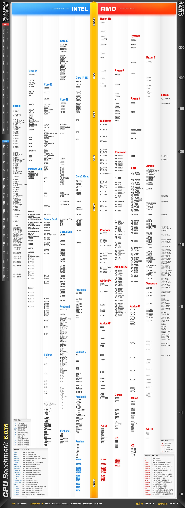

# Computer

## 基础知识

### CPU

#### 天梯图

+ [参考地址1](https://tieba.baidu.com/p/5005825360)
+ [包含11代的地址](https://www.mydrivers.com/zhuanti/tianti/cpu/)



#### 编号详解

+ [Intel编号详解](https://www.cnblogs.com/mehome/p/11549250.html)

  Intel(R)  Core(TM)  i5-6200U CPU @ 2.30GHz (4 CPUs), ~2.4GHz

  ```
  Intel（R）
  Intel（R）中文名：英特尔，这个是品牌，除了intel的还有AMD 这个品牌
  Core（TM）
  
  Core（TM）中文名：酷睿，这个是系列的名称，除了这个还有奔腾（PenTIum）系列、
  赛扬（Celeron）系列、至强（Xeon）系列、安腾（Itanium）系列、凌动（Atom）系列、Quark系列
  
  i5-品牌标识符，
  品牌标识符：用于区分产品的定位，以酷睿为例，有i3、i5、 i7、i9分别代表了品牌定位低、中、高端
  一般来说性能i3<i5<i7<i9
  
  6200
  6是指第六代
  200是指版本号，版本号越大越佳
  6-Gen标识
  Gen是Generation的缩写，指的是第几代，一般来说数字越大性能越好
  200-SKU数值
  
  SKU是Stock Keeping Unit的缩写，指定是库存量单元，一般来说在Gen标识相同的情况下，SKU数值越大
  代表性能越强
  U-产品线后缀
  
  产品线后缀这一位用字母表示，不同的字母代表了不同的含义，以Core（酷睿）品牌为例：
  
  台式机方面：
  
  K：代表可以超频；
  T：代表功耗优化
  笔记本电脑方面：
  
  M：代表移动端处理器；
  H：代表搭载高性能集成显卡；
  K代表可以超频; Q代表CPU有四个核心（一般只标注在默认2核心的CPU上，如果一款CPU的默认版本就是
  4核，也就不需要标注了）；
  U代表超低功耗；
  Y代表极低功耗；
  X代表Extreme，极限版，性能更强。当然也有同时有两个字母的，比如HK代表搭载高性能集成显卡并且
  可以超频。
  ```

+ AMD编号详解

  

### 显卡

### 硬盘

### 内存

### 主板

### 机箱

### 显示屏

### 键盘和鼠标

