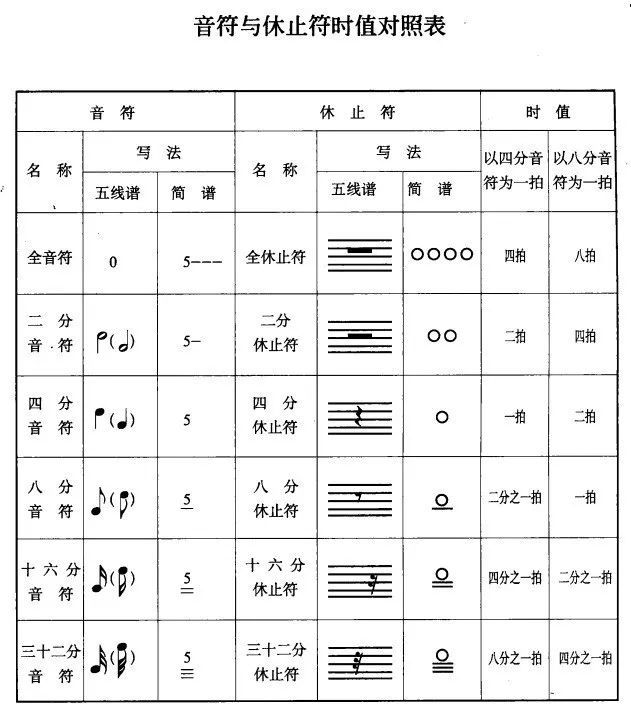
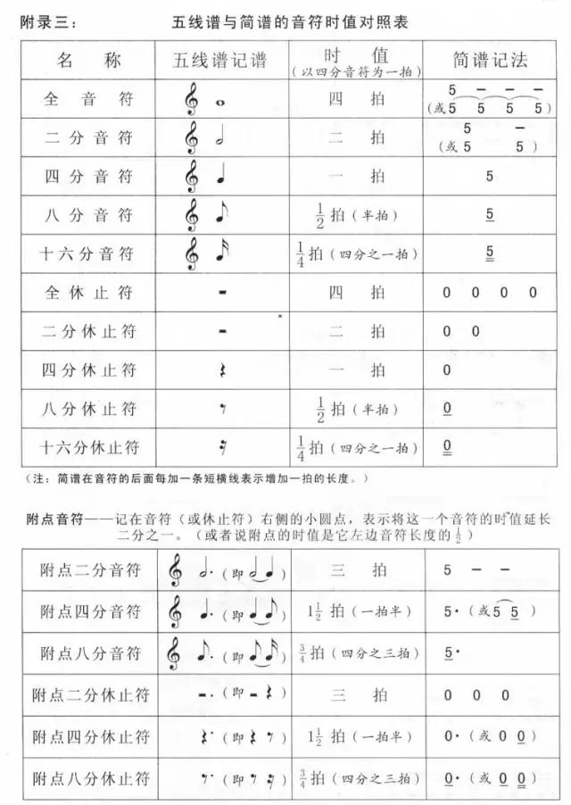
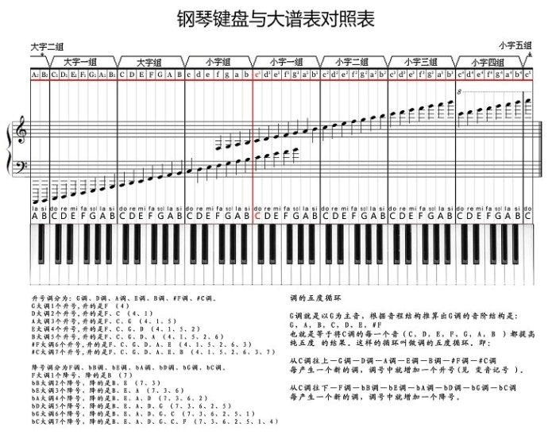

# 五线谱/简谱

## 基本概念

### 节拍

| 节拍  | 含义                          | 强弱之分                 | 单拍子和复拍子                       |
| ----- | ----------------------------- | ------------------------ | ------------------------------------ |
| 4/4拍 | 以四分音符为一拍,每小节有四拍 | 强，弱，次强，弱         | 复拍子（每小节两个或两个以上的强拍） |
| 2/4拍 | 以四分音符为一拍,每小节有两拍 | 强，弱                   | 单拍子（每小节有一个强拍子）         |
| 3/4拍 | 以四分音符为一拍,每小节有三拍 | 强，弱，弱               | 单拍子                               |
| 6/8拍 | 以八分音符为一拍,每小节有六拍 | 强，弱，弱，次强，弱，弱 | 复拍子                               |

### 音符

#### 附点音符

无论什么音符，只要带有附点，就延长附点前面音符的一半。常用的附点音符有一下几种： 简谱记谱法 名 称 拍 数 5 - - - · 附点全音符 4拍+2拍=6拍 5- · 附点二分之一 2拍+1拍=3拍 5· 附点四分之一 1拍+1/2拍=1拍半 5·（简谱）

#### 休止符

#### 切分音

一个音从节拍中的弱的部分开始，持续到后面较强的部分，使原来的弱位音变成了强音，这个节奏音就叫切分音

#### 三连音

一拍分为三个音

#### 音符的时值对照表

### 钢琴键盘对照表

