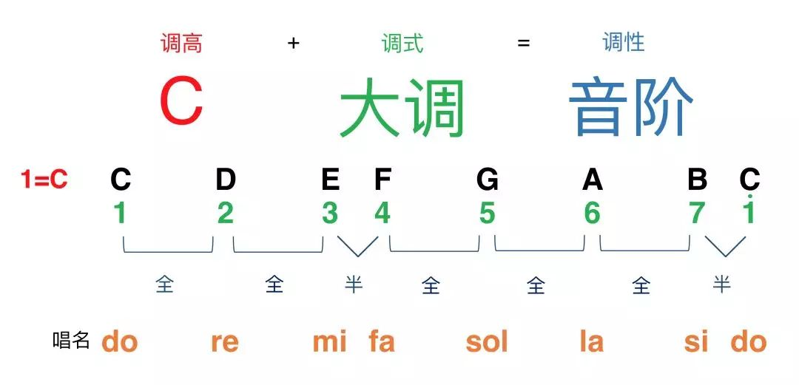

# 五线谱/简谱

## 基本概念

### 节拍

| 节拍  | 含义                          | 强弱之分                 | 单拍子和复拍子                       |
| ----- | ----------------------------- | ------------------------ | ------------------------------------ |
| 4/4拍 | 以四分音符为一拍,每小节有四拍 | 强，弱，次强，弱         | 复拍子（每小节两个或两个以上的强拍） |
| 2/4拍 | 以四分音符为一拍,每小节有两拍 | 强，弱                   | 单拍子（每小节有一个强拍子）         |
| 3/4拍 | 以四分音符为一拍,每小节有三拍 | 强，弱，弱               | 单拍子                               |
| 6/8拍 | 以八分音符为一拍,每小节有六拍 | 强，弱，弱，次强，弱，弱 | 复拍子                               |

### 音符

#### 附点音符

无论什么音符，只要带有附点，就延长附点前面音符的一半。常用的附点音符有一下几种： 简谱记谱法 名 称 拍 数 5 - - - · 附点全音符 4拍+2拍=6拍 5- · 附点二分之一 2拍+1拍=3拍 5· 附点四分之一 1拍+1/2拍=1拍半 5·（简谱）

#### 休止符


#### 切分音

一个音从节拍中的弱的部分开始，持续到后面较强的部分，使原来的弱位音变成了强音，这个节奏音就叫切分音

#### 三连音

一拍分为三个音

#### 音符的时值对照表


### 钢琴键盘对照表


#### 黑键


一个黑键可以有两个音，比如C和D之间的黑键。叫#C或者dD，表示一个半音。

### 音程

指两个音符之间的距离。用度作为单位。

+ 比如第一个键在C，另一个键在A，音程为6度
+ #X（表示黑键），还原至前一个白键，也就是还原到X
+ bX（表示黑键），还原至后一个白键，也就是还原到X

#### 属性

+ 纯：1度、4度、5度、8度
+ 大：2度、3度、6度、7度
+ 小：2度、3度、6度、7度

| 属性      | 格子（开始的键不算，后面的白键和黑键的总和） |
| --------- | -------------------------------------------- |
| 纯一度    | 0个格子（就是本身）                          |
| 纯四度    | 5个格子                                      |
| 纯五度    | 7个格子                                      |
| 纯八度    | 12（一圈了）                                 |
| 大二度    | 2个格子                                      |
| 大三度    | 4个格子                                      |
| 大六度    | 9个格子                                      |
| 大七度    | 11个格子                                     |
| 小二度    | 1个格子                                      |
| 小三度    | 3个格子                                      |
| 小六度    | 8个格子                                      |
| 小七度    | 10个格子                                     |
| 增四/减五 | 6个格子                                      |

```
/**
纯几度+1个格子=增几度
纯几度+2个格子=倍增几度
纯几度-1个格子=减几度
纯几度-2个格子=倍减几度

大几度+1个格子=增几度
大几度+2个格子=倍增几度
大几度-1个格子=小几度
小几度-1个格子=减几度
小几度-2个格子=倍减几度
**/

//步骤：
例子1：比如C到#F几度？？？
1、#F还原为F
2、数C到F之间的白键（包含C和F两个白键），为4个
3、数C到#F之间的格子（不包含C格子,黑键和白键的所有格子之和），为6个格子、
4、得出比纯四度多一个格子
5、所以C到#F为增4度

例子2：比如F到dB几度？？？
1、dB还原为B
2、数F到B之间的白键（包含F和B两个白键），为4个
3、数F到bB之间的格子（不包含F格子,黑键和白键的所有格子之和），为5个格子
4、与得出与纯四度一样
5、所以F到dB为纯四度
```

### 自然大调和自然小调

C自然大调音阶：全全半全全全半

C自然小调音阶：全半全全半全全



#### 全音和半音

相邻两个键则是半音关系，中间隔了个键则是全音关系

#### 乐名

C自然大调举例（[平时说的do都是C大调，其实do可以在任意位置](https://www.sohu.com/a/241162719_627719)）

| 名称   | 表示方式                   |
| ------ | -------------------------- |
| 唱名   | do ri mi fa so la xi       |
| 音名   | 1 2 3 4 5 6 7              |
| 简谱名 | C D E F G A B              |
| 乐名   | 主 上主 中 下属 属 下中 导 |

#### 十二大调

1. 在自然大调范围内，do在什么音名，就是什么大调。（比如do在G调上面，就是G大调）
2. 这每个调都使用这种方式去推理。得出有的调的音阶需要升半音，有的调的音阶需要降半音。

### 和弦

三个或三个以上不同的音构成的，

#### 三和弦

| 名称 | 解释                                                 |
| ---- | ---------------------------------------------------- |
| 定义 | 三个音以三度叠加在起来的和弦，即三和弦。             |
| 组成 | 根音，三音（距离根音有三度），五音（距离根音有五度） |
| 分类 | 大三和弦、小三和弦、增三和弦、减三和弦               |

```
常用的三和弦

五音  5  6  7  1  2  3  4 
三音  3  4  5  6  7  1  2
根音  1  2  3  4  5  6  7
和弦  C  Dm Em F  G  Am Bdim 
级数  1  2  3  4  5  6  7 
```


##### 大三和弦（比较常用）

大三度+小三度

```
//例子
如果根音为C，大三度则是D，小三度则是G，称为C大三和弦，写法G
```

##### 小三和弦

小三度+大三度

```
//例子
如果根音为C，小三度则是bE，大三度则是G，称为C小三和弦，写法Cm
```

##### 减三和弦

小三度+小三度

```
//例子
如果根音为C，小三度则是bE，大三度则是bG，称为C减三和弦，写法Cdim
```

##### 增三和弦

大三度+大三度

```
//例子
如果根音为C，大三度则是E，大三度则是#G，称为C增三和弦，写法Caug
```

